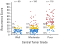
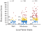
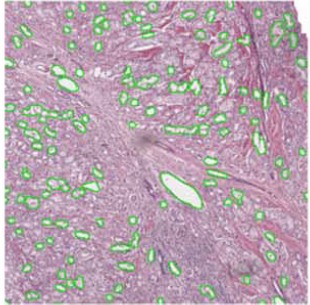
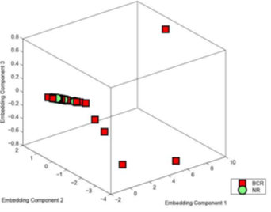
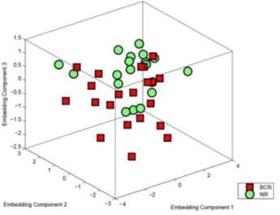
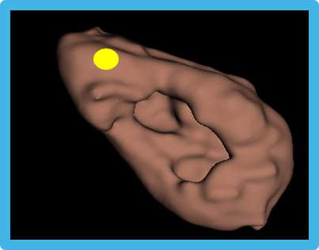
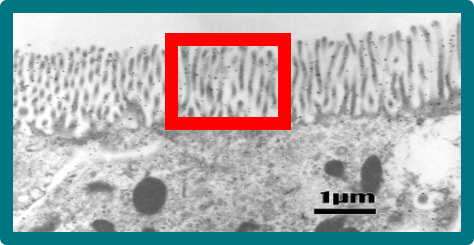

# 

## Machine Learning

A Brief Introduction

## Machine Learning Definitions

**Machine Learning** (ML) uses **collected data** to do something useful.

- Find underlying patterns (**knowledge discovery**)
- Simplify a complex phenomenon (**model building**)
- Place data into categories (**classification**)
- Predict future data (**regression**)

## Machine Learning Definitions

The job of the ML expert is to:

- Understand and identify the **goal**
- Collect **data**
- Select an appropriate **model** or **algorithm**
- Evaluate the system in terms of **costs**

## Types of Machine Learning

**Supervised Learning**

Train a model using labeled datasets to predict the class of new, unseen data

 
**Unsupervised Learning**

Identify natural groupings and patterns in unlabeled datasets

# 

## Example: Cancer Diagnosis

## Example: Biomedical Image Analysis

{ width=80% }

 
{ width=80% }

## Fine Needle Aspirates

{ width=80% }

 
{ width=80% }

**Problem Statement:** Predict whether a patient's tumor is benign or malignant, given an FNA image

## Data Definitions

The starting point for all ML algorithms is **data**.

So... what do we mean by "data"?

## Data Comes in Many Forms

{ width=70% }

## Quantitative Structure:  Expression of Disease State

Biological structure is **primary data**.

We can quantify **biological structure**.

We can **model** relationships between **structure and disease**.

## Fundamental Hypothesis

Changes in genomic expression manifest as physical changes in tumor morphology

{ width=80% }

 
{ width=80% }

<small>
S. S. Badve et al., JCO (2008)
</small>

## Fundamental Hypothesis

Changes in genomic expression manifest as physical changes in tumor morphology

{ width=80% }

<small>
Paik et al., N Engl J Med (2004)
</small>

## Data Fusion Improves Predictions

{ height=30% }

{ height=30% }

{ height=30% }

{ height=30% }

{ height=30% }

## Atoms to Anatomy Paradigm

{ width=100% }

{ height=356 width=456 }

{ height=356 width=456 }

{ height=356 width=456 }

{ height=356 width=456 }

{ height=356 width=456 }

{ height=356 width=456 }

# 

## Example: Cancer Diagnosis

## Fine Needle Aspirate Analysis

{ width=100% }

{ width=100% }

## Bulding Informative Features

**Domain knowledge** identifies useful features.

Pathologists already distinguish **beign** from **malignant** tumors.

Our job is to convert **qualitative** features to **quantitative** ones.

## Building Informative Features

The pathologist lists cell nuclei features of importance:

1. Radius
2. Texture
3. Perimeter
4. Area
5. Smoothness

6. Compactness
7. Concavity
8. Concave Points
9. Symmetry
10. Fractal Dimension

**Feature extraction** results in 30 feature values per image.

## Selecting Features for the FNA

To begin, we collect **training samples** to build a model.

- Collect a lot of example images for each class.
- Get our expert to label each image as "Malignant" or "Benign"
- Measure the features of interest (image analysis or by hand).
- Build a histogram of the measured feature.

## Texture of the Nuclei

<iframe frameborder="0" seamless='seamless' scrolling=no src="plots/texture_mean.html"></iframe>

## Average Radius of the Nuclei

<iframe frameborder="0" seamless='seamless' scrolling=no src="plots/radius_mean.html"></iframe>

## Characteristics of Good Features

- **Descriptive**: Similar within a class, and different between classes
- **Relevant**: Features should make sense
- **Invariant**: Not dependent on how you measure them

## Calculating Probabilities from Features

<iframe frameborder="0" seamless='seamless' scrolling=no src="plots/pdf_cdf.html"></iframe>

## Combinations of Features

**Combining features** often yields greater class separation.

## Multivariate Distribution

<iframe frameborder="0" seamless='seamless' scrolling=no src="plots/2d_scatter_histogram_plot.html"></iframe>

## Multivariate Distribution

<iframe frameborder="0" seamless='seamless' scrolling=no src="plots/2d_scatter_plot.html"></iframe>

## Tradeoff: Variance vs. Generalization

Linear boundaries do not model **variance** and miss obvious trends.

Complex boundaries fit training perfectly, but do not **generalize**.

In general, you want the **simplest** model with the best **performance**.

## Tradeoff: Variance vs. Generalization

Each of these decision boundaries makes errors!

There is always a tradeoff; we need to consider the **cost**.

Cost is defined by our goals and acceptable performance.

## Costs

How do we balance the errors we might make? Should we prioritize some kinds of
errors over others?

Not all mistakes carry the same cost. For example:

- A patient is told they have a tumor when they do not (**false positive**)
- A patient is told they are cancer-free when they are not (**false negative**)

# 

## Neural Networks

Building Blocks for Deep Learning

## Biological Inspiration for Neural Networks

## Anatomy of a[n Artificial] Neuron

## Simple Perceptron Decision Space

## Hidden Layer: Complex, Nonlinear Decision Space

## Simple Problem: XOR Classification

## Neural Network Solution to XOR

## Details of Neural Network Weights

## Training Neural Networks: Finding the Weights

## Why Is It Called A "Black Box"?

# 

## Deep Learning

How Does It Work?

## "Strong" AI

## "Weak" AI

## Deep Classifiers

Hand Crafted Features 
	Selecting features relevant to the image classes
Deep Learning
	Use the input samples themselves to identify classes

Innovations that make deep learning possible:
	Large amounts of well-annotated data
	Commodity-level, highly parallel hardware
	Innovations in training algorithms

## Simple Example: MNIST Handwriting Dataset

## Images in Neural Networks

## Images in Neural Networks

## Comparing Zeros to Ones

## Math of Neural Networks

## Math of Neural Networks

## Do You Know What This Is?

## How Do You Know?

## Modifications to NNs Needed

## Exploiting Spatial Relationships

## Convolutional Neural Network Architecture

## Filter Responses

## Patch-Based Classification: Segmentation

## Results of Classification (Patch-by-Patch Scale)

# 

## Thank You!

