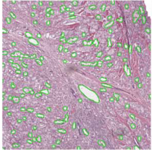

# 

## Machine Learning Definitions

**Machine Learning** (ML) uses **collected data** to do something useful.

<div class="txt-left">
<ul>
<li class="fragment">Find underlying patterns (**knowledge discovery**)</li>
<li class="fragment">Simplify a complex phenomenon (**model building**)</li>
<li class="fragment">Place data into categories (**classification**)</li>
<li class="fragment">Predict future data (**regression**)</li>
</ul>
</div>

## Machine Learning Definitions

The job of the ML expert is to:

<div class="txt-left">
<ul>
<li class="fragment">Understand and identify the **goal**</li>
<li class="fragment">Collect **data**</li>
<li class="fragment">Select an appropriate **model** or **algorithm**</li>
<li class="fragment">Evaluate the system in terms of **costs**</li>
</ul>
</div>

## Types of Machine Learning

<div class="l-double">
<div>
**Supervised Learning**

<p class="fragment">Use **labeled datasets** to classify new, unseen data</p>
</div>
<div> 
**Unsupervised Learning**

<p class="fragment">Use **unlabeled data** to identify natural groups</p>
</div>
</div>

<div class="l-double">
<div>
**Semi-Supervised Learning**

<p class="fragment">Use **partially labeled** data 
to handle the process</p>
</div>
<div> 
**Reinforcement Learning**

<p class="fragment">An **agent** learns to complete a task **policy** of rewards</p>
</div> 
</div>

# 

## Data Definitions

The starting point for all ML algorithms is **data**.

<p class="fragment">So... what do we mean by "data"?</p>

## Data Comes in Many Forms

{ width=70% }

## Computational Pathology:<br/> Expression of Disease State

<p class="fragment">Biological structure is **primary data**. </p>
<p class="fragment">We can quantify **biological structure**.</p>
<p class="fragment">We can **model** relationships between **structure and disease**.</p>

## Fundamental Hypothesis

Changes in genomic expression manifest as physical changes in tumor morphology

<div class="fragment l-double">
<div>
{ width=80% }
</div>
<div> 
{ width=80% }
</div>
</div>

<p class="fragment" style="text-align: left;"><small>
S. S. Badve et al., JCO (2008),
Paik et al., N Engl J Med (2004)
</small></p>

## Fundamental Hypothesis

Changes in genomic expression manifest as physical changes in tumor morphology

<div>
{ width=80% }
</div>

<p style="text-align: left;"><small>
S. S. Badve et al., JCO (2008),
Paik et al., N Engl J Med (2004)
</small></p>

## Data Fusion Improves Predictions

<div class="l-multiple" style="grid-template-columns: auto auto auto;">
<div style="grid-row: 1;">
{ height=30% }
</div>
<div style="grid-row: 1;">
{ height=30% }
</div>
<div style="grid-row: 1 / span 2;vertical-align: middle;">
{ height=30% }
</div>
<div style="grid-row: 2;">
{ height=30% }
</div>
<div style="grid-row: 2;">
{ height=30% }
</div>
</div>

## Atoms to Anatomy Paradigm

<div class="l-multiple" style="grid-template-columns: 1.5fr 1fr 1fr 1fr; row-gap:0;">
<div style="grid-row: 1 / span 2;">
{ width=100% }
</div>
<div style="grid-row: 1;">
{ height=356 width=456 }
</div>
<div style="grid-row: 1;">
{ height=356 width=456 }
</div>
<div style="grid-row: 1;">
{ height=356 width=456 }
</div>
<div style="grid-row: 2;">
{ height=356 width=456 }
</div>
<div style="grid-row: 2;">
{ height=356 width=456 }
</div>
<div style="grid-row: 2;">
{ height=356 width=456 }
</div>
</div>

## Building a Machine Learning Solution

How do we begin a machine learning project?

<div class="txt-left">
<ul>
<li class="fragment">What are the concerns with **pathology** in particular?</li>
<li class="fragment">What kinds of questions will help **save time, effort, and money?**</li>
<li class="fragment">How should we **interface** with collaborators?</li>
</ul>
</div>

# 

## Design Process

A Brief Overview

## Overall Process

{ width=100% }


# 

## Assess the Problem

{ width=100% }

## Problem Statement

What is the problem statement, in **one sentence**?

<p class="fragment">NOT the machine learning task, just the gap that needs to be
addressed.</p>

## Problem Statement

> Pathologists must review cytology slides to identify malignant versus benign
> tumors. 

## Current Solutions

What is the **current solution**?

<p class="fragment">How is the problem currently addressed, if at all?</p>

<p class="fragment">What data is currently routinely collected?</p>

## Current Solutions

> Based on cytology images, we can determine by eye whether a sample is benign
> or malignant.

## Domain Expertise

**Listen** to your potential users -- they are the experts!
<p class="fragment">**Domain knowledge** identifies useful features.</p>
<p class="fragment">Pathologists already distinguish **benign** from **malignant** tumors.</p>
<p class="fragment">Our job is to convert **qualitative** features to **quantitative** ones.</p>

## Building Informative Features

The pathologist lists **cell nuclei** features of importance:

<div class="l-double">
<div>
1. Radius
2. Texture
3. Perimeter
4. Area
5. Smoothness
</div>
<div>
6. Compactness
7. Concavity
8. Concave Points
9. Symmetry
10. Fractal Dimension
</div>
</div>

## Data Understanding

**Look at** the data that is currently collected for your problem!

<span class="fragment">
*"A picture might be worth a thousand words; a formula is worth a thousand
pictures."*
<span style="align: right"><sub>Dr. Edsger Dijkstra</sub></span>
</span>

## Fine Needle Aspirates

<div class="l-double">
<div>
{ width=80% }
</div>
<div> 
{ width=80% }
</div>
</div>


## Performance Targets

What is the goal of your system?

<p class="fragment">How will the success of the system be assessed?</p>

<p class="fragment">This determines your **overall performance measure**.</p>


## Questions to Ask

1. How much data do we have?
2. Does the data have labels associated with it? (Supervised vs. Unsupervised)
3. How expensive is it to acquire more data (time, effort, cost)?
4. What type of ML are you performing?
4. *Assuming you succeed*, what is the benefit?

## Assessing the Problem

At this point...

<h1 class="fragment" style="color: red;">STOP!</h1>

<p class="fragment">Is machine learning the right tool for the job?</p>


## Machine Learning Flowchart

{ width=80% }

## Assessing Machine Learning

Machine learning is **NOT** always the right choice.

<p class="fragment">**The sooner you identify whether ML will help, the better!**</p>

## Identify the ML Task

Having decided on an ML approach, **state the ML task to be completed.**

<p class="fragment">Similar to a problem statement, but a proposed solution to
the problem.</p>
<p class="fragment">Also similar to the **hypothesis statement** for a
scientific proposal.</p>

## Stated ML Task

> Given a digital FNA image, we can use image features to predict whether a
> patient's tumor is benign or malignant.

# 

## Acquire and Explore the Data

{ width=100% }

## Getting the Raw Data

How you acquire the dataset is project-specific.

<p class="fragment"> However, do **NOT** put this off!</p>

<p class="fragment"> Sensitive data (government, military, healthcare) may be
difficult to obtain, be embargoed, or censored. </p>

## Dataset Characteristics

Questions about the dataset:

<div class="txt-left">
<ul>
<li class="fragment">What type of data is it?</li>
<li class="fragment">What is the volume of data (in disk size)?</li>
<li class="fragment">What metadata is associated with the dataset?</li>
<li class="fragment">Where will it be stored and accessed?</li>
<li class="fragment">How will it be labeled and documented?</li>
</ul>
</div>

## Quickly Look at the Data Structure

Ensure that the downloaded data contains what you expect.

For **images**, look at them!

``` {python}

import matplotlib.pyplot as plt
plt.imshow(data_sample)
plt.show()
```

For **spreadsheets**, print their contents!

``` {python}
  
import pandas as pd
dataset = pd.load_csv(path_to_csv_file)
dataset.head()
dataset.info()
```

## Training and Testing Set

At **this point** you should split the data into a "training" and "testing" set.

<p class="fragment">This protects against **data snooping bias**!</p>
<p class="fragment">Model design should be completely blind to testing
data, to prevent potential overfitting.</p>
<p class="fragment">If you can hold off on retrieving testing data in the first
place, even better!</p>

## Training and Testing Split

How much data should go into training and testing?

<p class="fragment">Approximately **$\frac{2}{3}$** in training, **$\frac{1}{3}$** in
testing.</p>
<p class="fragment">How should you split your training and testing?</p>
<p class="fragment">**Random** versus **Stratified** splitting?</p>

## Random vs. Stratified Sampling

**Random Sampling**
<div class="txt-left">
<ul>
<li class="fragment">Randomly assign samples to training and testing</li>
<li class="fragment">Use a unique `id` for each sample to ensure reproducibility</li>
<li class="fragment">Useful in **unlabeled datasets**</li>
<li class="fragment">May lead to **class balance problems**</li>
</ul>
</div>

## Random Sampling Example

``` {python}

# Import functions to calculate a hash for the dataset
from zlib import crc32

def test_set_check(identifier, test_ratio):
    '''Return a boolean that states whether the current sample should be included in the testing set.
    
    Calculates a hash value from an identifier, and returns True if the value is in the bottom 
    (test_ratio)-percent of the maximum possible hash value.
    '''
    return crc32(np.int64(identifier)) & 0xffffffff < test_ratio * 2**32

def split_train_test_by_id(data, test_ratio, id_column):
    '''Return training and testing dataframes given a test ratio and column to use for computing sample hash.
    
    Uses test_set_check to actually compute hash and put the data into training or testing.
    '''
    ids = data[id_column]
    in_test_set = ids.apply(lambda id_: test_set_check(id_, test_ratio))
    return data.loc[~in_test_set], data.loc[in_test_set]

# Apply the above functions to the dataset
train_set, test_set = split_train_test_by_id(df, 0.3, "id")
```

## Random Sampling Class Imbalance

``` pre

================
 Random Sampling
================

Overall class balance:
B   0.63
M   0.37
Name: diagnosis, dtype: float64
 
Train set class ratio:
B   0.61
M   0.39
Name: diagnosis, dtype: float64
 
Test set class ratio:
B   0.67
M   0.33
Name: diagnosis, dtype: float64
```
## Random vs. Stratified Sampling

**Stratified Sampling**
<div class="txt-left">
<ul>
<li class="fragment">Maintain **class ratio** in the training and testing cases</li>
<li class="fragment">Ensures that train / test evaluation is on **equal terms**</li>
</ul>
</div>

## Stratified Sampling Example

``` {python}

# Stratified Split
from sklearn.model_selection import StratifiedShuffleSplit

# Create the splitting object
split = StratifiedShuffleSplit(n_splits=1, test_size=0.3, random_state=42)

# Apply the split to the data frame using the "diagnosis" column as our label
for train_index, test_index in split.split(df, df["diagnosis"]):
    train_set = df.loc[train_index]
    test_set = df.loc[test_index]
```

## Stratified Sampling Class Balance

``` {pre}

====================
 Stratified Sampling
====================

Overall class ratio:
B   0.63
M   0.37
Name: diagnosis, dtype: float64
 
Train set class ratio:
B   0.63
M   0.37
Name: diagnosis, dtype: float64
 
Test set class ratio:
B   0.63
M   0.37
Name: diagnosis, dtype: float64
```

# 

## Feature Visualization

Exploring the Feature Space

## Visualization Drives Initial Strategy

Looking at the data can provide **insights** into your data.

<p class="fragment">
You can evaluate natural groupings of samples and potential correlations between
features. 
</p>

<p class="fragment">
Let's look at nuclei texture feature as an example for our FNA dataset...
</p>

## Texture of the Nuclei

<iframe frameborder="0" seamless='seamless' scrolling=no src="plots/texture_mean.html"></iframe>

## Average Radius of the Nuclei

<iframe frameborder="0" seamless='seamless' scrolling=no src="plots/radius_mean.html"></iframe>

## Characteristics of Good Features

<div class="txt-left">
<p class="fragment">**Descriptive:** Similar within a class, and different between classes</p>
<p class="fragment">**Relevant:** Features should make sense</p>
<p class="fragment">**Invariant:** Not dependent on how you measure them</p>
</div>

## Calculating Probabilities from Features

<iframe frameborder="0" seamless='seamless' scrolling=no src="plots/pdf_cdf.html"></iframe>

## Combinations of Features

**Combining features** often yields greater class separation.

## Multivariate Distribution

<iframe frameborder="0" seamless='seamless' scrolling=no src="plots/scatter_histogram_plot.html"></iframe>

## Multivariate Distribution

<iframe frameborder="0" seamless='seamless' scrolling=no src="plots/scatter_plot.html"></iframe>

# 

## Prepare Data

{ width=80% }

## Data Cleaning

Most data you will receive is **noisy**:

<div class="txt-left">
<ul>
<li class="fragment">**Missing** or **incomplete** values</li>
<li class="fragment">**Text** or **categorical** values</li>
<li class="fragment">Features which are **poorly scaled**</li>
</ul>
</div>

## Missing Data

When creating a dataset, use a **unique**, **non-numeric** value to fill in
missing values.

<p class="fragment">Do **not**:</p>
<div class="txt-left">
<ul>
<li class="fragment">Leave cells blank</li>
<li class="fragment">Use an "obvious" numeric value (e.g. 99 or -99)</li>
<li class="fragment">Use any ambiguous data that could be misinterpreted</li>
</ul>
</div>

## Handling Missing Data

When pre-processing a dataset, decide what to do with missing data:

<div class="txt-left">
<ul>
<li class="fragment">**Drop data** with missing attributes</li>
<li class="fragment">**Remove attributes** that are not complete</li>
<li class="fragment">**Set missing values** to some other value</li>
</ul>
</div>

## Handling Text and Categories

Text and categorical values should be converted to numeric values.

<div class="txt-left">
<ul>
<li class="fragment">**Ordinal values** can be placed in some ("Low", 
"Intermediate", "High")</li>
<li class="fragment">**Non-ordinal values** cannot be placed in order (blood
type A or B)</li>
</ul>
</div>

## Ordinal Encoding

Ordinal values can be converted directly into numbers: 

<div class="txt-left">
- Low = 0
- Intermediate = 1
- High = 2
</div>

## Ordinal Encoding

``` {python}

from sklearn.preprocessing import OrdinalEncoder
ordinal_encoder = OrdinalEncoder()
```

## One-Hot Encoding

Non-ordinal values can be encoded with **one-hot encoding**:

<p class="fragment">
Replace the feature with $N$ new features, where $N$ is the number
of categories. Each of the new features is *binary*, meaning it's only 0 or 1.
</p>

## One-Hot Encoding

|  id | Blood Type |
|-----|------------|
| 001 | A          |
| 002 | B          |
| 003 | B          |
| 004 | A          |
| 005 | B          |

## One-Hot Encoding

|  id | Type A | Type B |
|-----|--------|--------|
| 001 |      1 |      0 |
| 002 |      0 |      1 |
| 003 |      0 |      1 |
| 004 |      1 |      0 |
| 005 |      0 |      1 |

## One-Hot Encoding

``` {python}

from sklearn.preprocessing import OneHotEncoder
cat_encoder = OneHotEncoder()
```

## Label Encoding

``` {python}

from sklearn.preprocessing import LabelEncoder
label_encoder = LabelEncoder()

diagnosis_cat = df['diagnosis']

# Fit the encoder to the categories, and immediately 
diagnosis_lab = label_encoder.fit_transform(diagnosis_cat)

# Add the diagnosis label back to the dataframe
df['diagnosis_label'] = diagnosis_lab
```

## Feature Scaling

Data should always be scaled.

<p class="fragment">
Scaling should be calculated **only on the training set**, and the proper
transform applied to testing.
</p>

## Feature Scaling: Min-Max Scaling

**Min-Max Scaling / Normalization**: 
$$ x = \frac{x - \min{(x)}}{\max{(x - \min{(x)})}} $$

## Feature Scaling: Standardization

**Standardization**: 
$$ x = \frac{x - \mu}{\sigma} $$

<span class="fragment">
Not bounded to any specific range, which may be a problem (e.g. for neural
networks expecting a 0-1 value), but much less affected by outliers.
</span>

## Code Considerations

Always write code to do your feature pre-processing.

You will be able to apply the same transforms each time, even if datasets grow.

# 

## Model Selection and Training

{ width=80% }

## Overall Objective

Model selection is an **art** rather than a **science**.

Recall Occum's Razor: 

> Given a set of possible solutions, the one which makes the fewest assumptions
> is preferable. 

Also often restated as: The simplest solution is best!

## Simple Model: Linear Discriminant

So what does a "simple model" mean?

Start looking at linear methods, like a `LinearDiscriminant`:

``` {python}

from sklearn.lda import LDA

lin_disc = LDA()
lin_disc.fit(training_data, training_labels)

training_predictions = lin_disc.predict(training_data[:10,:])

```

## Simple Model: Linear Regression

Check the performance of this system using root-mean-square error: 

``` {python}

from sklearn.metrics import mean_squared_error
lin_mse = mean_squared_error(training_labels[:10], training_predictions)
lin_rmse = np.sqrt(lin_mse)
print("Linear Regressor Root Mean Squared Error: ", lin_rmse)
```

## Complex Model: Support Vector Machines

We can compare this model to more complex ones, like a support vector machine:

``` {python}

from sklearn.svm import SVC

svm_model = SVC()
svm_model.fit(training_data, training_labels)

training_predictions = svm_model.predict(training_data[:10,:])

svm_mse = mean_squared_error(training_labels[:10], training_predictions)
svm_rmse = np.sqrt(svm_mse)
print("Support Vector Machine Root Mean Squared Error: ", svm_rmse)
```

## Training and Evaluating on Training Set

Evaluation on subsets of training data is the **best possible outcome**!

<p class="fragment">
Since the system has trained on this data, it is more likely to do well.
</p>

<p class="fragment">
Complex models are likely to get 100% performance: This is **overfitting**!
</p>

## Variance vs. Generalization

Simple linear boundaries do not model **variance** and miss obvious trends.
<p class="fragment">Complex boundaries fit training perfectly, but do not **generalize**.</p>
<p class="fragment">In general, you want the **simplest** model with the best **performance**.</p>

## Tradeoff: Variance vs. Generalization

Each of these decision boundaries makes errors!
<p class="fragment">There is always a tradeoff; we need to consider the **cost**.</p>
<p class="fragment">Cost is defined by our goals and acceptable performance.</p>

## Costs

Should we prioritize some kinds of errors over others?

<div class="fragment txt-box">
Not all mistakes carry the same cost. For example:

- A patient is told they have a tumor when they do not (**false positive**)
- A patient is told they are cancer-free when they are not (**false negative**)
</div>

## Revisiting Train / Test Splits

To get a **real** sense of the performance of your system, you should train on
your training data and then evaluate on testing data:

``` {python}

testing_predictions = svm_model.predict(testing_data)
svm_mse = mean_squared_error(training_labels, training_predictions)
svm_rmse = np.sqrt(svm_mse)
print("Support Vector Machine Root Mean Squared Error: ", svm_rmse)
```

<p class="fragment">
However: What if you (randomly) get a really good or bad testing set?
</p>

## Cross-Validation

What if you could create several train / test splits, with all of the benefits
we discussed earlier?

<p class="fragment">
This is **cross-validation**: Break the dataset into several (distinct) training
and testing sets, and then perform training and testing on each one.
</p>

## Cross-Validation

This can be easily done in `scikit-learn`: 

``` {python}

from sklearn.model_selection import cross_val_score

scores = cross_val_score(svm_model, training_data, training_labels,
scoring="neg_mean_squared_error", cv=10)
svm_rmse_scores = np.sqrt(-scores)

# Display scores
def display_scores(scores):
print("Scores: ", scores)
print("Mean: ", scores.mean())
print("Standard Deviation: ", scores.std())

display_scores(svm_rmse_scores)
```

## Cross-Validation Reporting

Now you have a way to robustly compare models.

<p class="fragment">
After you pick a model, it's time to **make it better!**
</p>

# 

## Fine-Tuning and Evaluation

{ width=80% }

## Parameters and Hyperparameters

There are **a lot** of "knobs" you can turn to opitimize a model.

If you've robustly quantified model performance, now it's okay to tweak away.

## Parameter Optimization

This process is **parameter optimization:** trying all the parameters to see
which gives you the best performance.

## Side Note: Pipelines in Python

`scikit-learn` enables you to build **pipelines** to process your data.

These allow you to build a list of different values to try, plus a scoring
function, and then returns the **best** numbers out of what it's tried.

## Grid Search: Build a Pipeline

``` {python}

from sklearn.pipeline import Pipeline

pipe = Pipeline(steps=[
    ('classification', classifier)
])
```

## Grid Search: Define the Grid of Parameters

``` {python}

from sklearn.model_selection import GridSearchCV

# Set the parameters by cross-validation
param_grid = {
    'classification__kernel': ['rbf'],
    'classification__gamma': [1e-1, 1e-2, 1e-3, 1e-4],
    'classification__C': [1, 1e1, 1e2, 1e3],
}

```

## Grid Search: Build a Model and Evaluate It

``` {python}

svm_model = SVC()

grid_search = GridSearchCV(svm_model, param_grid, cv=5,
                           scoring='neg_mean_squared_error',
                           return_train_score=True)

grid_search.fit(training_data, training_labels)
```

## Evaluate on Test Set

Finally, you can predict labels on your testing set:

``` {python}

final_model = grid_search.best_estimator_

final_predictions = final_model.predict(testing_data)

final_mse = mean_squared_error(testing_labels, final_predictions)
final_rmse = np.sqrt(final_mse)
```

# 

## Feedback Loop (Production)

{ width=80% }

## Feedback Importance

This section is **very** implementation dependent.

<p class="fragment">
However, there are a few steps...
</p>

## List of Feedback Steps

<div class="txt-left">
<ol>
<li class="fragment">
Write tests to ingest production inputs into the system
</li>
<li class="fragment">
Write monitoring code to check live performance
</li>
<li class="fragment">
Write code for input Quality Assurance
</li>
<li class="fragment">
Periodically audit the system by re-training on new data
</li>
<li class="fragment">
Create auto backups and snapshots of long-running models
</li>


</ol>
</div>

# 

## Concluding Remarks

Takeaway Thoughts

## Team Science

You will often be working as part of a team.

<p class="fragment">
You may only be responsible for some of the workflow steps...
</p>

<p class="fragment">
... But understanding them is critical to making your project successful.
</p>

# 

## Thank You!

# 

# 

## Histological Risk Model

| Variable | Definition       | Points |
|----------|------------------|--------|
| WPOI 1   | Pushing Border   |      0 |
| WPOI 2   | Finger Growths   |      0 |
| WPOI 3   | Large Islands    |      0 |
| WPOI 4   | Small Islands    |     +1 |
| WPOI 5   | Tumor Satellites |     +3 |
|          |                  |        |

Histological Risk Model

<p style="text-align: left;"><small>
Brandwein, M., et al., Am J of Surg Path (2010)
</small></p>

## Histological Risk Model

<div class="l-double">
<div>
{ width=80% }
</div>
<div> 
{ width=80% }
</div>
</div>

<p style="text-align: left;"><small>
Brandwein, M., et al., Am J of Surg Path (2010)
</small></p>

## Data Understanding

<div class="l-double">
<div>
{ width=75% }
</div>
<div> 
{ width=75% }
</div>
</div>

## Data Understanding

<div class="l-double">
<div>
{ width=75% }
</div>
<div> 
{ width=75% }
</div>
</div>
