# 

## Machine Learning

A Brief Introduction

## Machine Learning Definitions

**Machine Learning** (ML) uses **collected data** to do something useful.

<ul>
<li class="fragment">Find underlying patterns (**knowledge discovery**)</li>
<li class="fragment">Simplify a complex phenomenon (**model building**)</li>
<li class="fragment">Place data into categories (**classification**)</li>
<li class="fragment">Predict future data (**regression**)</li>
</ul>

## Machine Learning Definitions

The job of the ML expert is to:

<ul>
<li class="fragment">Understand and identify the **goal**</li>
<li class="fragment">Collect **data**</li>
<li class="fragment">Select an appropriate **model** or **algorithm**</li>
<li class="fragment">Evaluate the system in terms of **costs**</li>
</ul>

## Types of Machine Learning

**Supervised Learning**

Use **labeled datasets** to classify new, unseen data

 
**Unsupervised Learning**

Use **unlabeled data** to identify natural groups

# 

## Example: Cancer Diagnosis

## Example: Biomedical Image Analysis

{ width=80% }

 
{ width=80% }

## Fine Needle Aspirates

{ width=80% }

 
{ width=80% }

**Problem Statement:** Predict whether a patient's tumor is benign or malignant, given an FNA image

## Data Definitions

The starting point for all ML algorithms is **data**.

So... what do we mean by "data"?

## Data Comes in Many Forms

{ width=70% }

## Quantitative Structure:  Expression of Disease State

Biological structure is **primary data**. 

We can quantify **biological structure**.

We can **model** relationships between **structure and disease**.

## Fundamental Hypothesis

Changes in genomic expression manifest as physical changes in tumor morphology

{ width=80% }

 
{ width=80% }

<small>
S. S. Badve et al., JCO (2008),
Paik et al., N Engl J Med (2004)
</small>

{ width=80% }

## Data Fusion Improves Predictions

{ height=30% }

{ height=30% }

{ height=30% }

{ height=30% }

{ height=30% }

## Atoms to Anatomy Paradigm

{ width=100% }

{ height=356 width=456 }

{ height=356 width=456 }

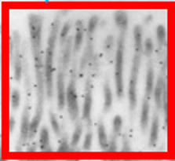{ height=356 width=456 }

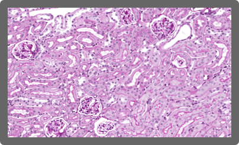{ height=356 width=456 }

{ height=356 width=456 }

{ height=356 width=456 }

# 

## Machine Learning

Learning from Feature Data

## Fine Needle Aspirate Analysis

{ width=100% }

{ width=100% }

## Building Informative Features

**Domain knowledge** identifies useful features.

Pathologists already distinguish **benign** from **malignant** tumors.

Our job is to convert **qualitative** features to **quantitative** ones.

## Building Informative Features

The pathologist lists **cell nuclei** features of importance:

1. Radius
2. Texture
3. Perimeter
4. Area
5. Smoothness

6. Compactness
7. Concavity
8. Concave Points
9. Symmetry
10. Fractal Dimension

**Feature extraction** results in 30 feature values per image.

## Selecting Features for the FNA

To begin, we collect **training samples** to build a model.

<ul>
<li class="fragment">Collect a lot of example images for each class</li>
<li class="fragment">Get our expert to label each image as "Malignant" or "Benign"</li>
<li class="fragment">Measure the features of interest (image analysis or by hand)</li>
<li class="fragment">Build a histogram of the measured feature</li>
</ul>

## Texture of the Nuclei

<iframe frameborder="0" seamless='seamless' scrolling=no src="plots/texture_mean.html"></iframe>

## Average Radius of the Nuclei

<iframe frameborder="0" seamless='seamless' scrolling=no src="plots/radius_mean.html"></iframe>

## Characteristics of Good Features

**Descriptive:** Similar within a class, and different between classes

**Relevant:** Features should make sense

**Invariant:** Not dependent on how you measure them

## Calculating Probabilities from Features

<iframe frameborder="0" seamless='seamless' scrolling=no src="plots/pdf_cdf.html"></iframe>

## Combinations of Features

**Combining features** often yields greater class separation.

## Multivariate Distribution

<iframe frameborder="0" seamless='seamless' scrolling=no src="plots/scatter_histogram_plot.html"></iframe>

## Multivariate Distribution

<iframe frameborder="0" seamless='seamless' scrolling=no src="plots/scatter_plot.html"></iframe>

## Variance vs. Generalization

Linear boundaries do not model **variance** and miss obvious trends.

Complex boundaries fit training perfectly, but do not **generalize**.

In general, you want the **simplest** model with the best **performance**.

## Tradeoff: Variance vs. Generalization

Each of these decision boundaries makes errors!

There is always a tradeoff; we need to consider the **cost**.

Cost is defined by our goals and acceptable performance.

## Costs

Should we prioritize some kinds of errors over others?

Not all mistakes carry the same cost. For example:

- A patient is told they have a tumor when they do not (**false positive**)
- A patient is told they are cancer-free when they are not (**false negative**)

# 

## Neural Networks

Building Blocks for Deep Learning

## Biological Inspiration for Neural Networks

{ width=75% }

## Anatomy of a[n Artificial] Neuron

{ width=75% }

## Simple Perceptron Decision Space

{ width=75% }

## Hidden Layers: Complex Decision Space

{ width=75% }

## Simple Problem: XOR Classification

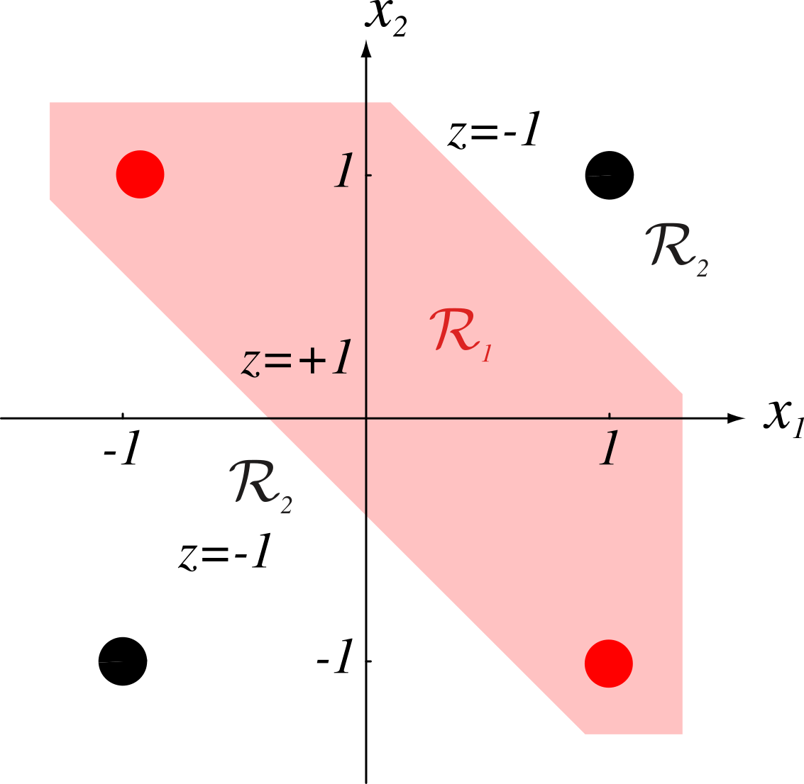{ width=35% }

## Neural Network Solution to XOR

{ width=50% }

## Details of Neural Network Weights

{ width=35% }

## Training Neural Networks: Finding the Weights

{ width=60% }

Step 3: Calculate error of the result

Step 4: Calculate gradients and modify weights and biases

Step 2: Calculate network output

Step 1: Pick a training example

## Why Is It Called A "Black Box"?

<iframe frameborder="0" seamless='seamless' scrolling=yes src="https://playground.tensorflow.org/"></iframe>

# 

## Deep Learning

How Does It Work?

## "Strong" AI

{ width=100% }

{ width=100% }

{ width=100% }

## "Weak" AI

{ width=100% }

{ width=100% }

{ width=100% }

## Deep Classifiers

**Hand Crafted Features:** Selecting features relevant to the image classes

**Deep Learning:** Use the input samples themselves to identify classes

Innovations that make deep learning possible:

<ul>
<li class="fragment">Large amounts of well-annotated data</li>
<li class="fragment">Commodity-level, highly parallel hardware</li>
<li class="fragment">Innovations in training algorithms</li>
</ul>

## Simple Example: MNIST Handwriting Dataset

{ width=30% }

## Images in Neural Networks

## Images in Neural Networks

## Comparing Zeros to Ones

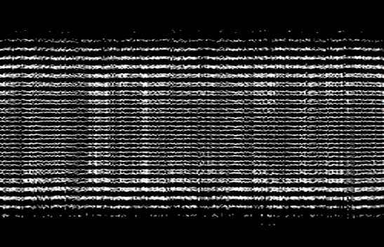{width=100%}

{width=100%}

## Images in Neural Networks

{width=80%}

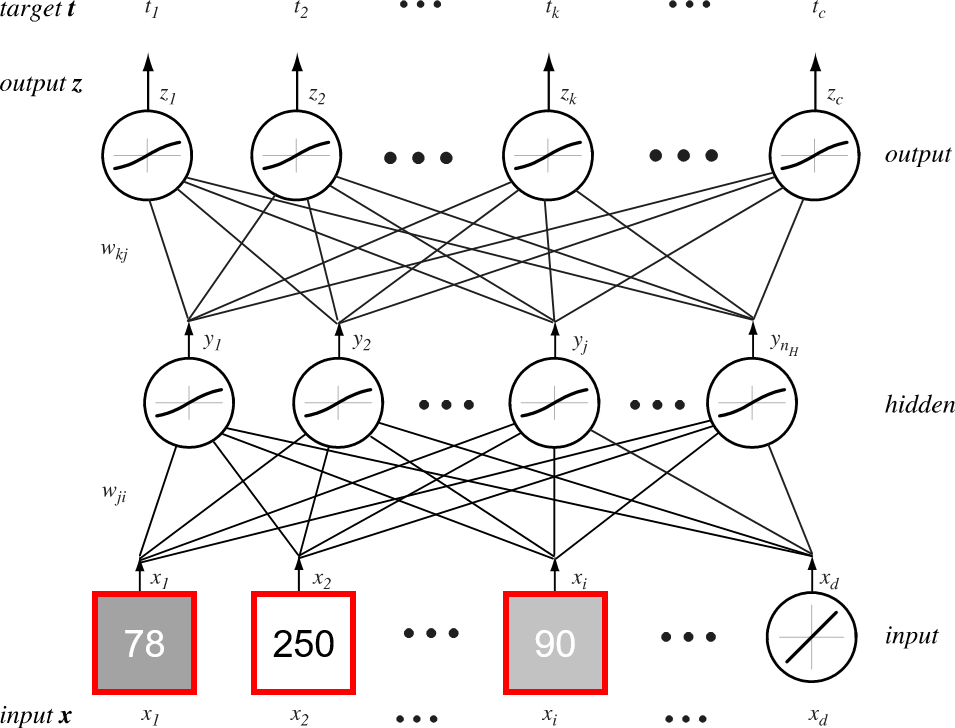{width=80%}

## Images in Neural Networks

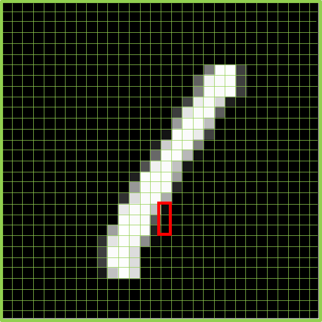{width=80%}

{width=80%}

## Do You Know What These Are?

{width=80%}

{width=80%}

## Do You Know What These Are?

{width=80%}

{width=80%}

## How Do You Know?

Let's do some quick **calculations**...

- Number of pixels: $64\times64=4,096$
- Color values: $4,096\times3=12,288$

With just over **12,000 values**, our brains can identify the type of object in this image.

That seems like a lot, but that's just **12kb** worth of input data!

But we aren't done yet...

{width=80%}

## Modifications to NNs Needed

- Input Size: 12,288
- Hidden Units (double): 24,000
- Input-to-Hidden Weights: 294 Million
- Output Classes: 3
- Hidden-to-Output Weights: 882 Million

**Total Weights: 1.17 Billion**

Our brains do a **ton** of computing!

We need a new approach...

{width=80%}

## Exploiting Spatial Relationships

Images have some nice properties:

**Spatially Localized:** Allows us to restrict the number of weights from input to output

**Scale-dependent:** Reducing image scale allows us to find connections between shapes and objects

{width=80%}

## Convolutional Neural Network Architecture

{width=100%}

## Filter Responses

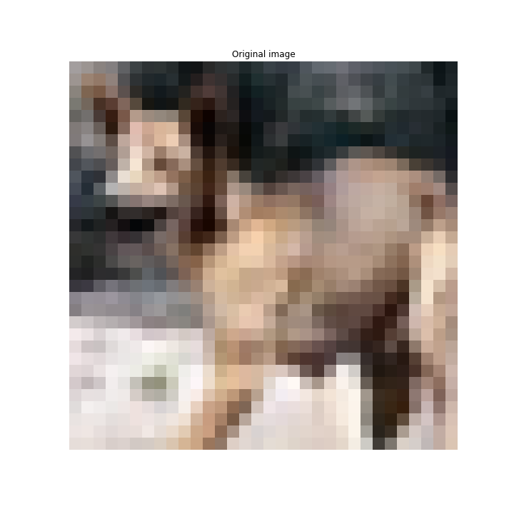

{width=100%}

## Filter Responses

{width=60%}

## Patch-Based Classification: Segmentation

{ width=33% }

## Filter Responses

{width=80%}

{width=80%}

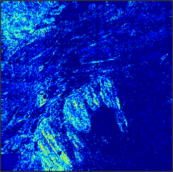{width=80%}

{width=80%}

## Results of Classification

# 

## Need for Annotations

The Importance of Data

## Large, Annotated Datasets

ML benefits from **large, well-annotated** datasets

**Natural** images are abundant, easy-to-label data

However, it's not so easy for **pathology**...

## Natural vs. Specialized Image Datasets

{ width=100% }

{ width=100% }

{ width=100% }

## Human Faces Are Well-Annotated

## Dog Faces Are Still Common

## Medical Images are Sparse

!https://cloud.google.com/vision(img/he_imagesearch01.png)

## There Is Some Data However

## Disparity in Dataset Sizes

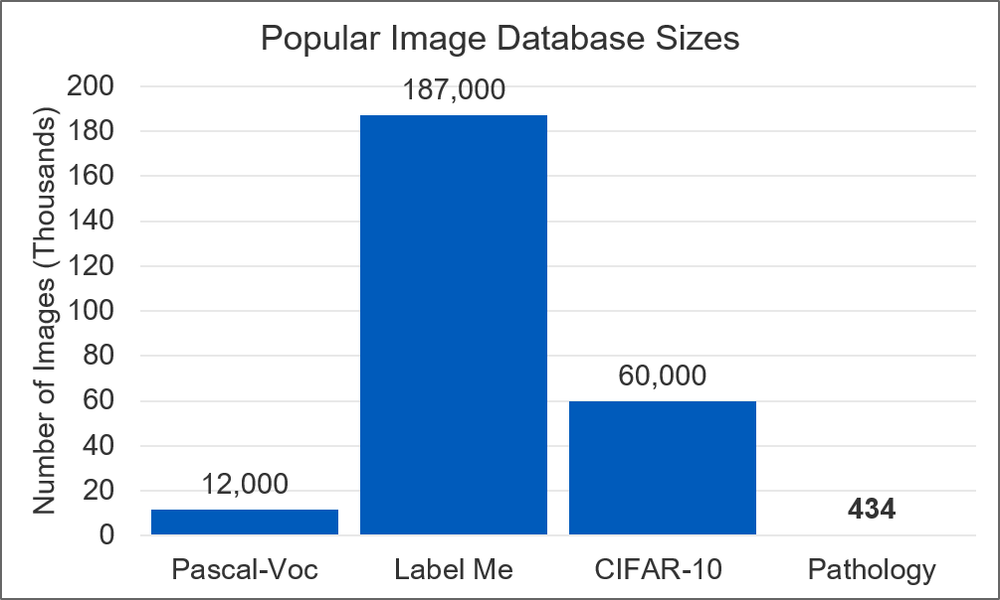

## Challenges in Building Pathology Datasets

**Data Generation:** Limited scope, proprietary software, lack of standards

**Data Hosting / Access:** Large, high throughput storage options needed

**Annotations:** Difficult, time-consuming, application dependent

## Difficulty in Annotating Samples

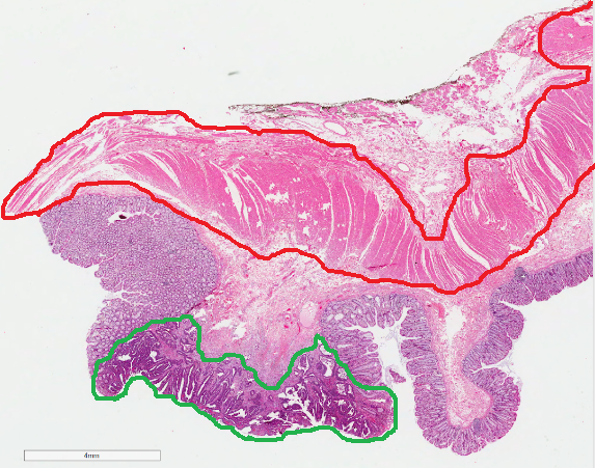{ width=100% }

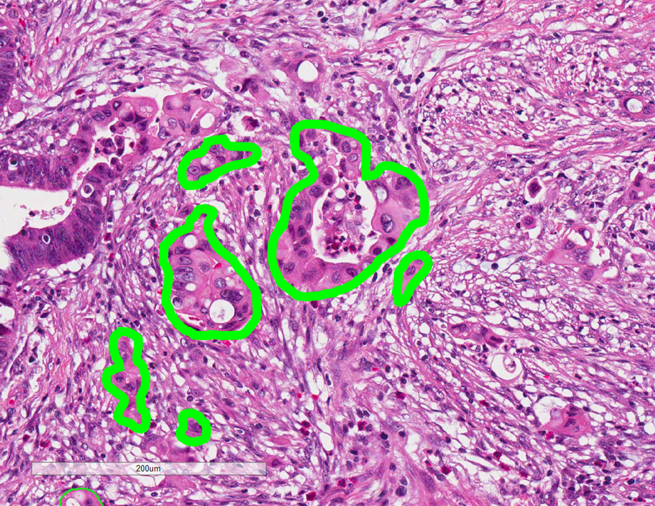{ width=100% }

## Addressing Annotation with Formal Training

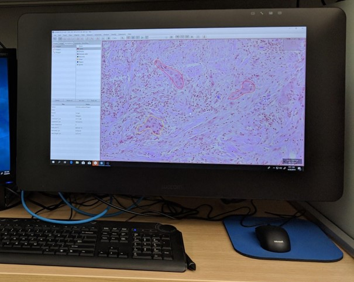{ width=100% }

{ width=100% }

# 

## Thank You!

