# 

## Computational Cell Biology, Anatomy, and Pathology

Modernizing Medical Curricula

## Jacobs School of Medicine and Biomedical Sciences

<iframe
src="https://www.google.com/maps/embed?pb=!1m18!1m12!1m3!1d374106.2934798287!2d-79.11410949052187!3d42.900161599625655!2m3!1f0!2f0!3f0!3m2!1i1024!2i768!4f13.1!3m3!1m2!1s0x89d312af82c770df%3A0xd7f9a7357ec78bee!2sJacobs%20School%20Of%20Medicine%20And%20Biomedical%20Sciences!5e0!3m2!1sen!2suk!4v1579598356116!5m2!1sen!2suk"
width="600" height="450" frameborder="0" style="border:0;"
allowfullscreen=""></iframe>

## Downtown Buffalo Campus

{ width=100% }

## PhD in Pathology and Anatomical Sciences

> Our PhD program in Computational Cell Biology, Anatomy
> and Pathology aims to produce scientists with  yellow;">knowledge of biological principles at all levels of
> scale and who are enabled by proficiency
> in computational imaging methodologies
> and  style="background-color: yellow;">data analyses.

## Atoms to Anatomy Paradigm

{ width=100% }

{ height=356 width=456 }

{ height=356 width=456 }

{ height=356 width=456 }

{ height=356 width=456 }

{ height=356 width=456 }

{ height=356 width=456 }

## Quantitative Structure:  Expression of Disease State

Biological structure is **primary data**. 

We can **quantify** biological structure.

We can **model** relationships between **structure and disease**.

## Fundamental Hypothesis

Changes in genomic expression manifest as physical changes in tumor morphology

{ width=80% }

 
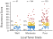{ width=80% }

<small>
S. S. Badve et al., JCO (2008),
Paik et al., N Engl J Med (2004)
</small>

## Fundamental Hypothesis

Changes in genomic expression manifest as physical changes in tumor morphology

{ width=80% }

<small>
S. S. Badve et al., JCO (2008),
Paik et al., N Engl J Med (2004)
</small>

## Data Fusion Improves Predictions

{ height=30% }

{ height=30% }

{ height=30% }

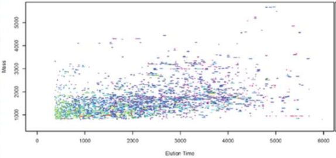{ height=30% }

{ height=30% }

<small>
Lee, G., et al. IEEE TMI (2019)
</small>

## Training Students in AI

Engineer-Physician Training

## AI Is Just Another Test

**Understanding the Methodology**

<ul><li class="fragment">“How does this test work? What does it require to run?”</li></ul>

**Interpreting the Results**

<ul><li class="fragment">“What are the outputs I can expect?”</li></ul>

**Software Solutions for AI-Human Interaction**

<ul><li class="fragment">“How do I do it?”</li></ul>

# 
## Understanding the Methodology

How Does It Work, and What Does It Require

## How Does Machine Learning Work?

<ul>
<li class="fragment">Supervised vs. Unsupervised Methods</li>
<li class="fragment">Feature Engineering</li>
<li class="fragment">Data Visualization</li>
</ul>

## Example Problem: Fine Needle Aspirates

{ width=80% }

 
{ width=80% }

**Problem Statement:**  Predict whether a patient's tumor is
benign or malignant, given an FNA image

## Building Informative Features

**Domain knowledge** identifies useful features.

Pathologists **already** distinguish benign from malignant tumors.

Our job is to convert **qualitative** features to **quantitative** ones.

## Building Informative Features

The pathologist lists **cell nuclei** features of importance:

1. Radius
2. Texture
3. Perimeter
4. Area
5. Smoothness

6. Compactness
7. Concavity
8. Concave Points
9. Symmetry
10. Fractal Dimension

**Feature extraction** results in 30 feature values per image.

## Texture of the Nuclei

<iframe frameborder="0" seamless='seamless' scrolling=no src="plots/texture_mean.html"></iframe>

## Average Radius of the Nuclei

<iframe frameborder="0" seamless='seamless' scrolling=no src="plots/radius_mean.html"></iframe>

## Multivariate Distribution

<iframe frameborder="0" seamless='seamless' scrolling=no src="plots/scatter_histogram_plot.html"></iframe>

## What Data is Required for Machine Learning?

<ul>
<li class="fragment">Data Collection / Feature Extraction</li>
<li class="fragment">Data Wrangling and Cleaning</li>
</ul>

## Characteristics of Good Features

**Descriptive:** Similar within a class, and different between classes

**Relevant:** Features should make sense

**Invariant:** Not dependent on how you measure them

## Another Example: Oral Cavity Cancer

{ width=80% }

{ width=80% }

## OCC Characteristics

| WPOI   | Definition                   | Points |
|--------|------------------------------|--------|
| Type 1 | Pushing border               |      0 |
| Type 2 | Finger-like Growth           |      0 |
| Type 3 | Large Islands, >15 cells     |      0 |
| Type 4 | Small islands, <=15 cells    |     +1 |
| Type 5 | Satellites, >=1mm from Tumor |     +3 |
|        |                              |        |

<small>
Brandwein, et al., Am. J of Surg. Path. (2010),
Li, et al. Head and Neck Path. (2013),
Sinha, et al. Mod. Path. (2018)
</small>

## Extracting Architecture

{ width=80% }

{ width=80% }

## Extracting Architecture

{ width=80% }

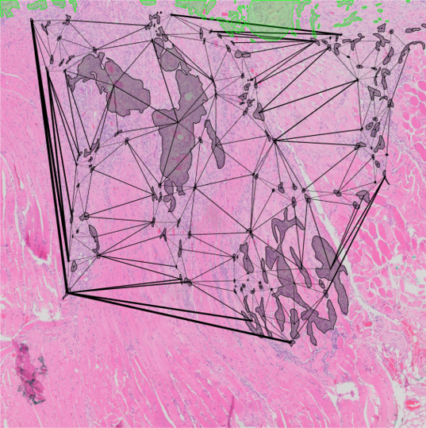{ width=80% }

## Extracting Architecture

{ width=80% }

{ width=80% }

## Quantitative Features as Classifiers

{ width=50% }

<small>
$$ \begin{bmatrix}
39.7 \\
1189.5 \\
1149.8 \\
192.7 \\
211.6 \\
\vdots \\
\end{bmatrix} $$</small>

{width=80%}

{ width=50% }

<small>
$$ \begin{bmatrix}
35.8 \\
1314.1 \\
1278.2 \\
313.8 \\
339.8 \\
\vdots \\
\end{bmatrix} $$</small>

# 
## Interpreting the Results

What do the Outputs Mean

## Calculating Probabilities from Features

<iframe frameborder="0" seamless='seamless' scrolling=no src="plots/pdf_cdf.html"></iframe>

## Understanding Segmentation Probabilities

{width=100%}

## Segmentation Output

{ width=80% }

{ width=80% }

## Probabilistic Segmentation

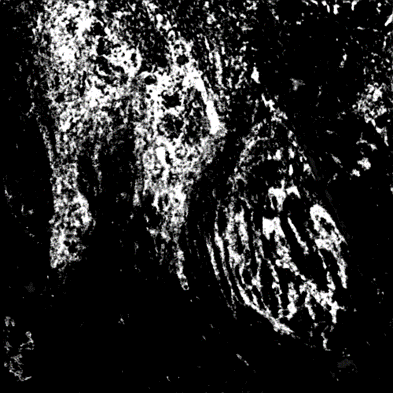{width=100%}

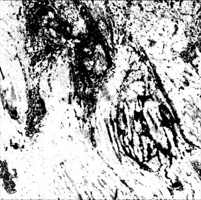{width=100%}

{width=100%}

# 
## Computational Assignments

Coding Homework for Non-Engineers

## Nuclei Annotations for Cell Types in Fiji

{width=70%}

## Displaying Annotated Patches

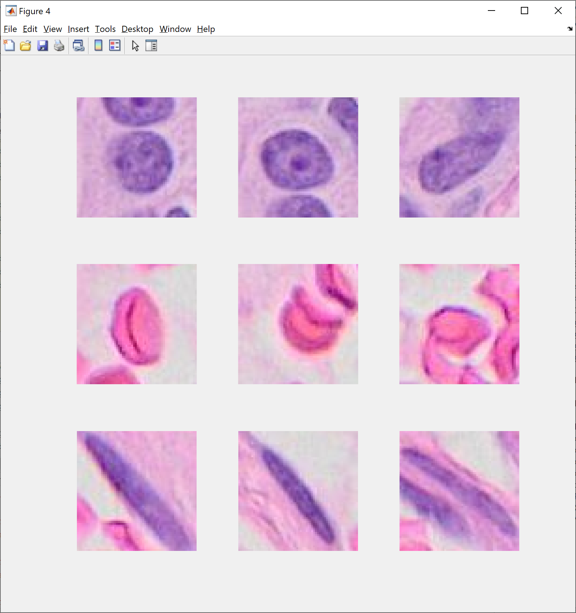{width=45%}

## Representing Data in Colorspace

{width=70%}

## Running Classification in MATLAB

{width=70%}

## Data Clustering

<ul>
<li>Do the data clusters separate out, or are they mixed?</li>
<li class="fragment">Will RGB values be able to distinguish between them?</li>
<li class="fragment">Can other image traits distinguish these groups more easily?</li>
</ul>

## Classification

<ul>
<li>What are the classification error rates?</li>
<li class="fragment">Try to reduce error by adjusting classifier parameters.</li>
</ul>

## Classification Learner

<ul>
<li>Which classifier performed the best?</li>
<li class="fragment">Did any classifier achieve 100% performance? If so, which one?</li>
<li class="fragment">Create a Confusion Matrix. Which classes are misclassified the most?</li>
</ul>

# 
## Software Solutions for ML / AI

Walking the Walk

## Software Stack

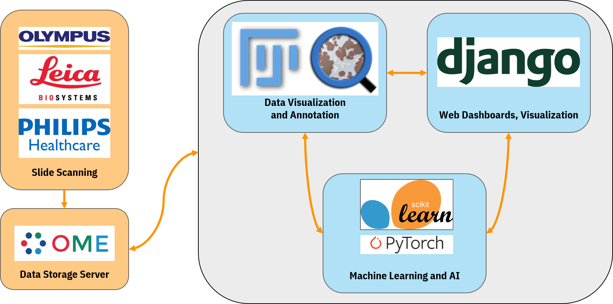{width=70%}

## Digital Image Storage: Omero

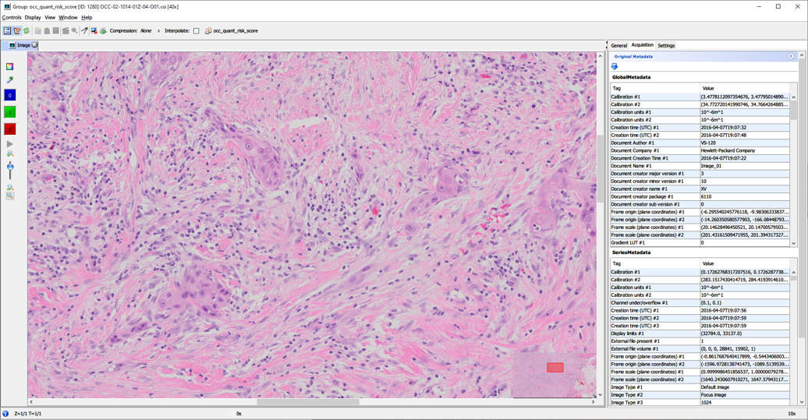{width=70%}

## Human-in-the-Loop: Annotation Stations

{height=90%}

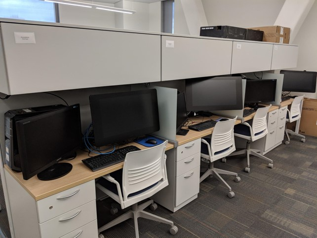{height=90%}

## Online Annotations

{ width=60% }

## Online Quality Assurance and Feedback

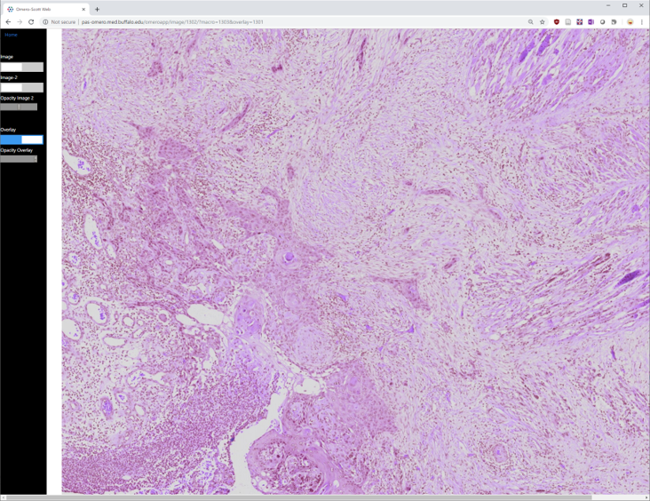{width=80%}

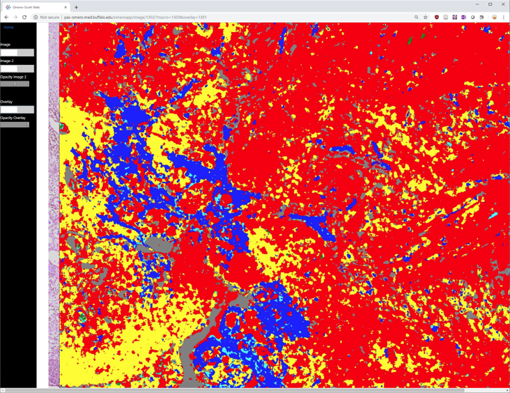{width=80%}

## Online Quality Assurance and Feedback

{width=50%}

# 

## Concluding Remarks

## Goals of the Program

<ul>
<li>Pathologists will be users of these tools.</li>
<li class="fragment">They should understand:</li>
<ul>
<li class="fragment">How they work</li>
<li class="fragment">How to interpret them</li>
<li class="fragment">When they are an appropriate test to order for a
patient</li>
</ul>
<li class="fragment">**We are open to suggestions and advice on building this program!**</li>
</ul>

# 

## Thank You!

