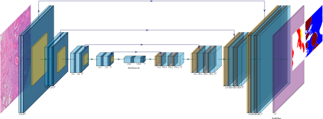
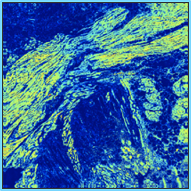
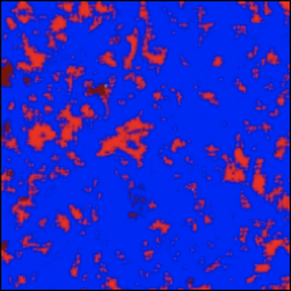
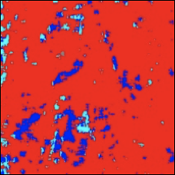
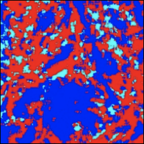
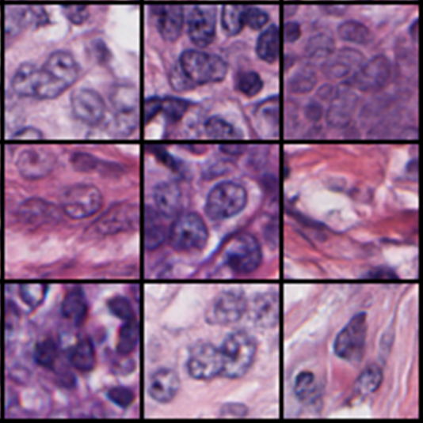
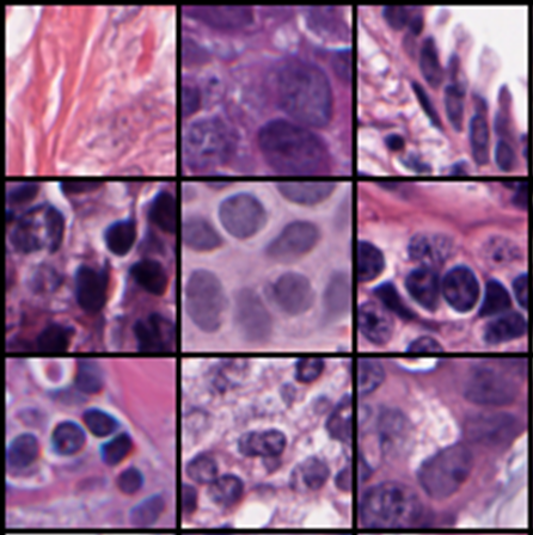

# 

## Training AI Students

Petabyte Pedagogy

## Why Is It Called a "Black Box"?

<iframe frameborder="0" seamless='seamless' scrolling=yes src="https://playground.tensorflow.org/"></iframe>

## Teaching a School of AI Students

**Solution:** Interrogate the system to see what it's "thinking"!

<ul>
<li class="fragment">**Classification Output** (What is this?)</li>
<li class="fragment">**Intermediate Representation** (How did you get your answer?)</li>
<li class="fragment">**Active Learning** (What are you confused about?)</li>
<li class="fragment">**Error Analysis** (What did you get wrong?)</li>
<li class="fragment">**Generative Models** (Draw a picture of what you think this is.)</li>
</ul>

# 

## Classification Output

*What Is This?*

## Deep Learning for Pathology Segmentation

Can we replace manual annotations with deep learning?

**Patient Data:** Small, use traditional ML

**Pixel Data:** Dense, use deep learning

{ width=80% }

## Deep Learning for Pathology Segmentation

{width=100%}

## Deep Learning Segmentation

{ width=80% }

{ width=80% }

## Deep Learning Segmentation

{ width=80% }

{ width=80% }

## Deep Learning Segmentation

<video controls>
  <source src="img/montage.mp4" type="video/mp4">
Your browser does not support the video tag.
</video>

# 
## Intermediate Representations

**How did you get your answer?**

## Semantic Segmentation Filters

{ width=45% }

{ width=100% }

{ width=100% }

{ width=100%}

{ width=100% }

## Improving Training Efficiency: Active Learning

**Random Learning (RL):** Annotate everything!

**Active Learning (AL):** Only annotate the good stuff!

<ul>
<li class="fragment">Achieve higher performance using the same number of
samples</li>
<li class="fragment">Use fewer annotated samples to hit a target
performance</li>
</ul>

## Active Learning Pipeline

{ width=80% }

## Active Learning Pipeline

{ width=80% }

## Progression of Random Training

{ width=100% }

{ width=100% }

{ width=100% }

{ width=100% }

## Progression of Active Training

{ width=100% }

{ width=100% }

{ width=100% }

{ width=100% }

# 
## Double-Checking AI

Fragile Neural Networks

## Fragile Neural Networks

Image **normalization** is critical for neural networks.

**Small changes** in image quality can drastically affect
deep learning performance.

Serial sections help us explore fragility with a
minimum of biological or technical variability.

**Excellent test set for quality assurance!**

## Fragile Neural Networks

{width=70%}

{width=70%}

## Fragile Neural Networks

{width=70%}

{width=70%}

## Fragile Neural Networks

{width=35%}

## Importance of QA and Human-in-the-Loop

Obviously, normalization and background lighting correction can solve this specific problem...

But what about the “generalization” of neural networks?

**What other variation exists that we aren’t aware of a
priori? **

{width=70%}

## Generative Models: Draw Me A Picture

**Variational Autoencoders** and **Generative Adversarial Networks** can recreate images from a learned “latent space” of possible images in the domain.

Can we train a system to recognize medical image structures?

{width=70%}

## Nuclei GAN: Which is Real, Which is Fake?

{width=100%}

{width=100%}

## Nuclei GAN: Learning to See

<video style="width: 40%;" controls>
  <source src="img/nuclei_montage.mp4" type="video/mp4">
Your browser does not support the video tag.
</video>

# 
## Concluding Remarks

## AI is the Student, Not the Master

You can interrogate AI to understand it better.

In training AI, you can develop a deeper understanding of
your data by thorough review and classification.

By reviewing and re-training, you understand the AI "thought
process" in a lot of detail, **even if you don't know the details of how the
system is programmed.**

A lot like students!

## This is Just the Beginning

**Interpretable AI** is a huge field, the surface of which I have not scratched. 

As we develop more efficient teaching methods, it helps us
understand our students -- human or AI -- a little better.

It also leads us to more thorough understanding of the
subject matter as well.

# 

## Thank You!

